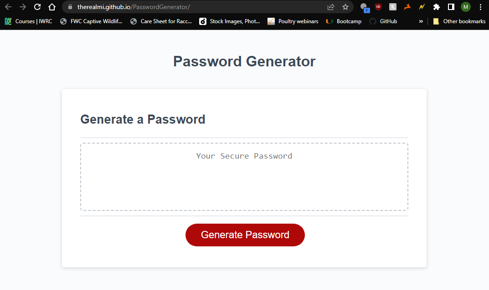
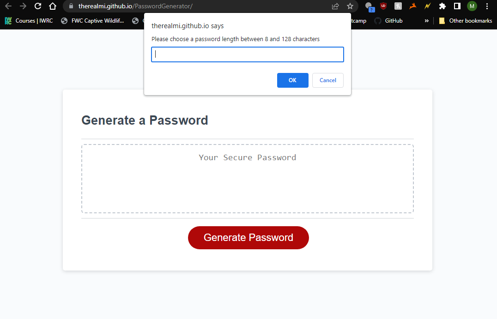
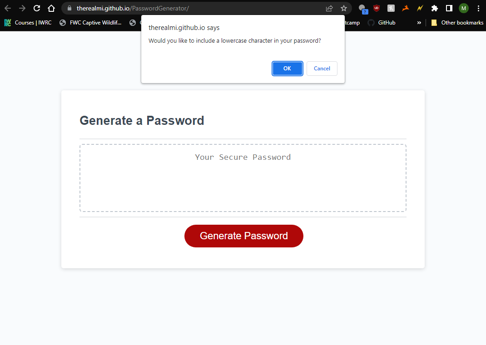
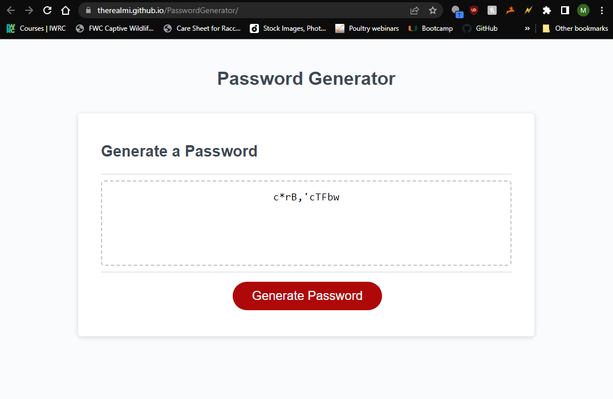

# PasswordGenerator

## Description

This is the third coding challenge for full stack coding bootcamp. The site allows users to generate a password that meets criteria they specify through prompt boxes.

## Table of Contents 

- [Installation](#installation)
- [Usage](#usage)
- [Credits](#credits)
- [License](#license)

## Installation

You can access this project by clicking the following link: https://therealmi.github.io/PasswordGenerator/

## Usage
This Password generator asks the user for the following specifications: password length, lowercase characters, uppercase characters, numbers, and special characters.

These specifications will appear in a window prompt once the user clicks the "Generate Password" button.

Once the user enters a valid password length and specifies which characters to include in their password, the website will display the newly generated password within the text box.

Users may then copy and utilize the password if they wish. 

## Credits

[Coding Bootcamp](https://courses.bootcampspot.com)

[Professor Phil Loy](https://github.com/philliploy)

[w3 Schools](https://www.w3schools.com/)

## License

[Please refer to the license on the repo](LICENSE)
